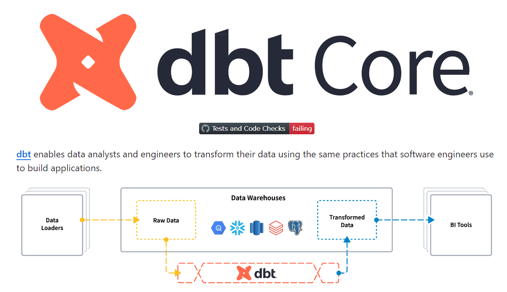
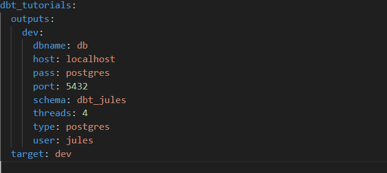

Welcome to your new dbt project!
you will learn how to install dbt, initialize a new project and then publish your project to a GitHub repository.

### What is Dbt?
- **dbt (data build tool)** enables analytics engineers to transform data in their warehouses by simply writing select statements. dbt handles turning these select statements into tables and views.

- dbt does the T in ELT (Extract, Load, Transform) processes – it doesn’t extract or load data, but it’s extremely good at transforming data that’s already loaded into your warehouse. 

- dbt connects to and runs SQL against your database, warehouse, lake, or query engine. These SQL-speaking platforms are collectively referred to as data platforms. dbt connects with data platforms by using a dedicated adapter plugin for each. Plugins are built as Python modules that dbt Core discovers if they are installed on your system
- The most popular adaptaters are **Postgres**, **BigQuery**, **Databricks**, **Spark**, **Redshift**, **Snowflake**, etc...

    

  
### Using the starter project
#### Firslty, you create your projects folder:
 - mkdir dbt_tutorials

#### Secondly, you create an environnement, activate it and install dbt with the adaptater postgres.
 - PS: You can choice another adapters or just do **python -m pip install dbt-core**
 - python3 -m venv dbt-venv
 - ./venv/Scripts/activate (activate the environment for Windows) or source dbt-venv/bin/activate (activate the environment for Mac and Linux )
 - python -m pip install dbt-postgres
   
#### Then you initialize your dbt projects with : dbt init [project_name]. 
 - example : I use **dbt init dbt_tutorials**.

#### Configure your profiles.yml file
 - When you call dbt from the cli, dbt analyses the **dbt_projects.yml** and gets the **profiles.yml** that dbt needs to connect to our data warehouse.
 - A profile contains all the details required to connect to your data warehouse.
 - dbt will look the profiles.yml file in the current working directory first, then in  **~/.dbt** or **C:/Users/your_name/.dbt/profiles.yml**.
 - The image below shows my example of profiles.yml file with the adaptater postgres
     

#### Try running the following commands:
- dbt debug to verify the connection with postgresql
- dbt run
- dbt test

### Resources:
- Learn more about dbt [in the docs](https://docs.getdbt.com/docs/introduction)
- Learn more about dbt fundamentals [in courses](https://courses.getdbt.com/courses/fundamentals)
- Check out [Discourse](https://discourse.getdbt.com/) for commonly asked questions and answers
- Join the [chat](https://community.getdbt.com/) on Slack for live discussions and support
- Find [dbt events](https://events.getdbt.com) near you
- Check out [the blog](https://blog.getdbt.com/) for the latest news on dbt's development and best practices
